1. qoder体验配额失效问题：配额展示是0，收到了注册后的免费的体验配额邮件但是发现又做不了请求,怀疑是境内外账号没有打通的网络问题,切换到qoderCn后无本问题
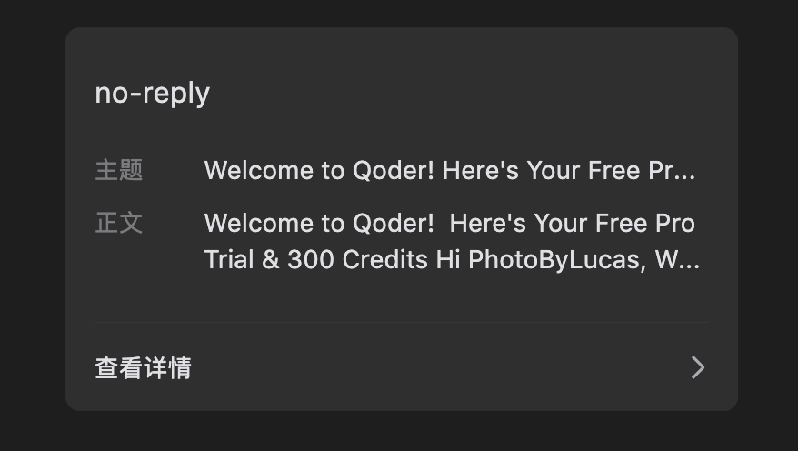
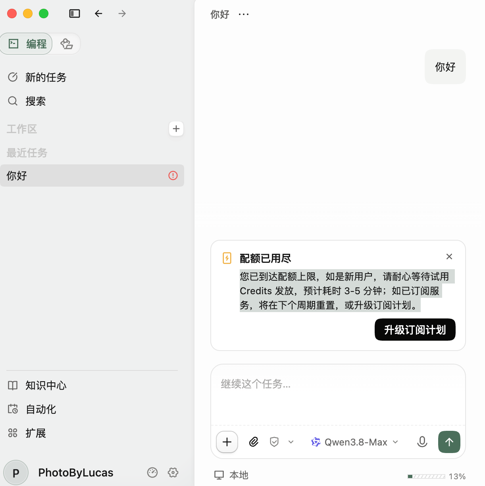
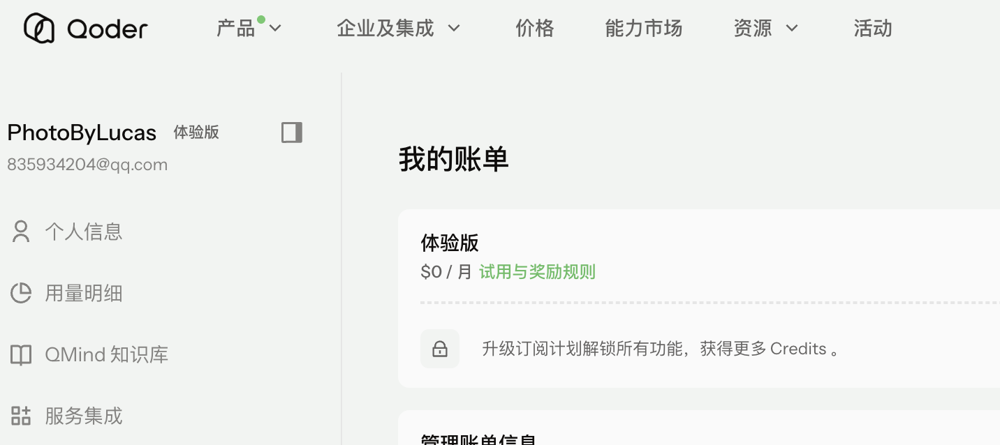
2. 请求拦截失败时仍然展示产出，其实是没有产出的
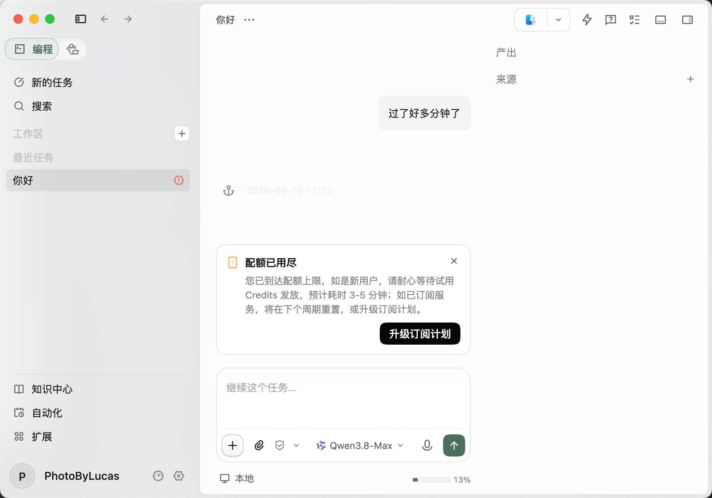
3. 做了一个简单的鹈鹕骑单车,发现对于动态的svg没有正常渲染,需要chrome打开才会动
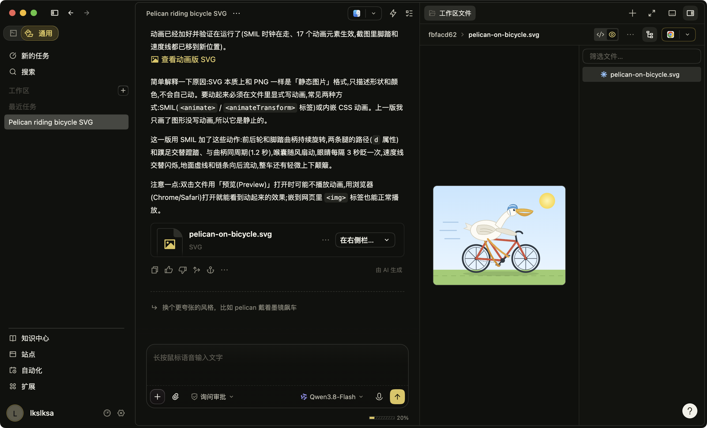
4. 在qodercn且默认语言都是中文情况下,因为提示词是英文的,数据的回答结果也是英文,没有按照用户记忆来输出
5. 输出过程中的 思考一下/同步一下/检查一下,对于新用户来说比较难以获取到有效的进度知识
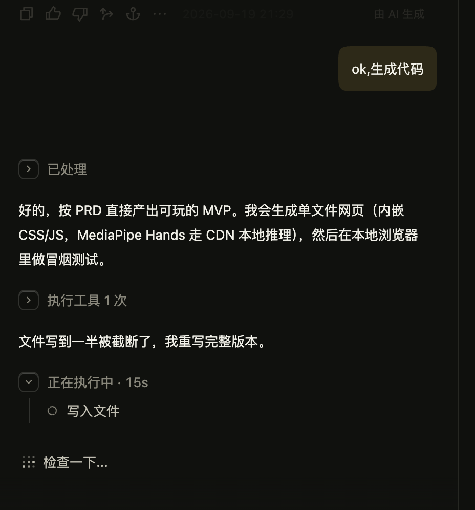
6. 插话功能需要手动点击触发
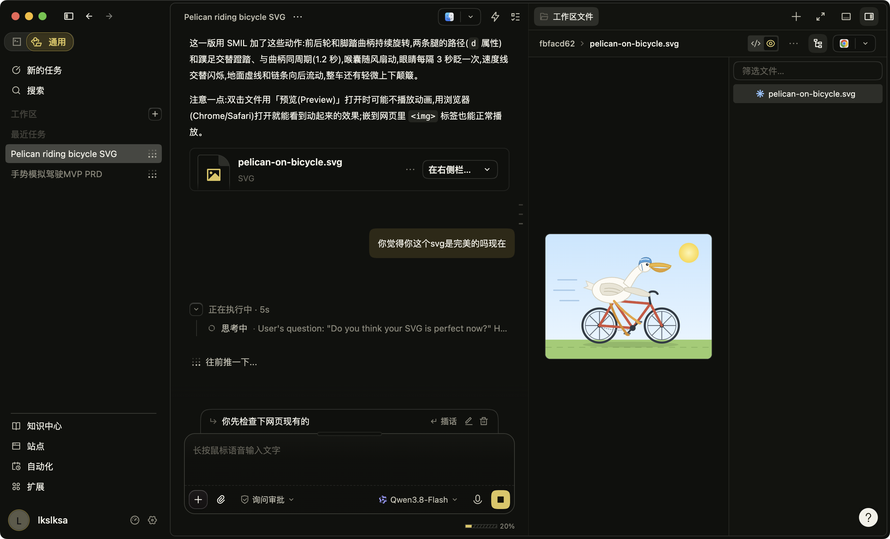
7. 查看错误工具节点时,点击后不自动展开点击内容到可视区域,需要用户手动滚动
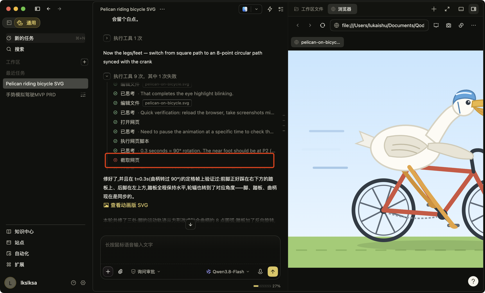 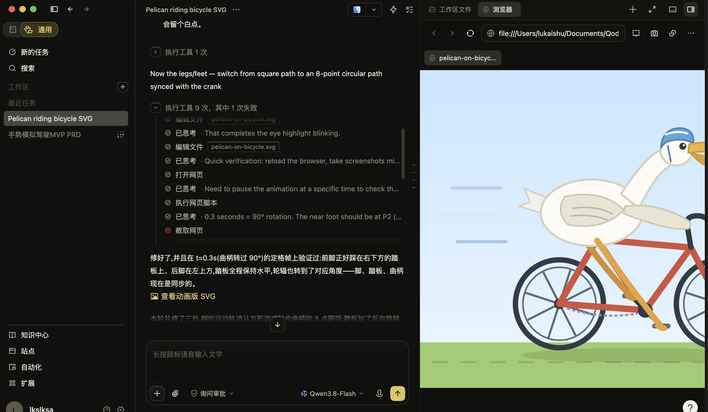
8. 模板小功能非常有用,值得推荐
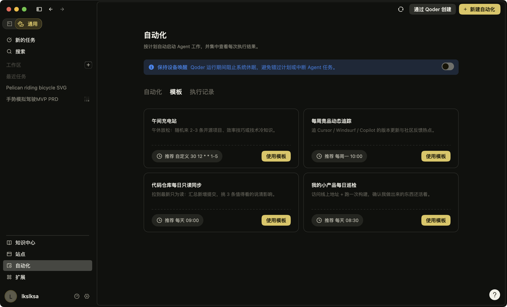
9. brower user功能有缺陷,无法开启权限授权,在codex下可以正常开启
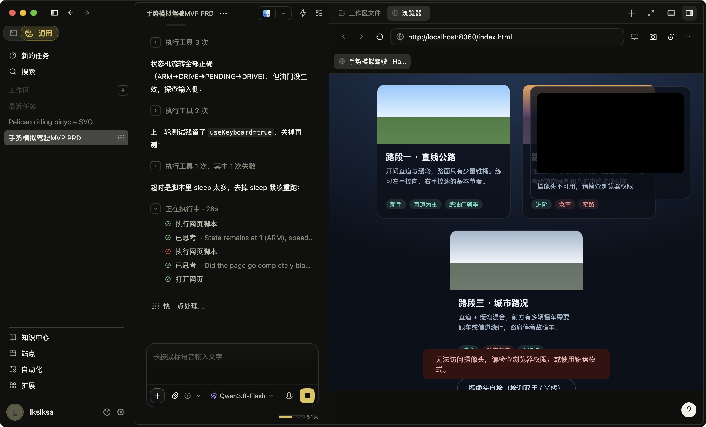
10. 暗色模式切换后icon会有自适应,非常好评
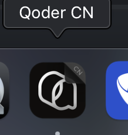
11. 在pc端中，qoder是支持跳转阿里云登录页，通过支付宝直接扫码打开的，但是移动端没有支持支付宝登录